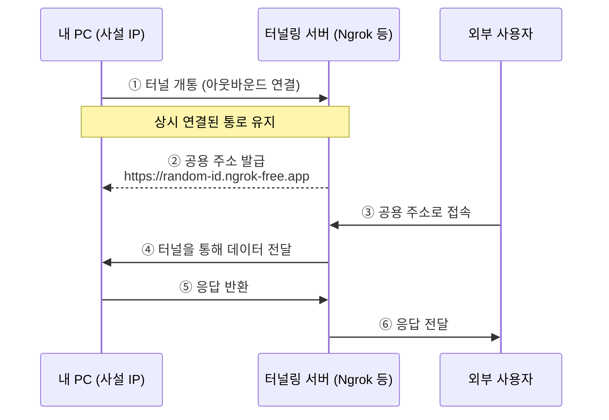

# 터널링 (Tunneling)

> [!abstract] 한 줄 요약
> 터널링은 내부 기기가 **먼저 외부 서버로 아웃바운드 연결**을 맺어 통로를 만들고, 외부 요청을 그 통로로 전달받는 **리버스 프록시 기반 기술**이다.

---

## 1. 포트포워딩 vs 터널링

[[네트워크 기초#8. 외부에서 사설 네트워크로 접속하는 방법|포트포워딩]]은 **밖→안** 방향으로 방화벽(문)을 열어야 하므로, 공유기 설정이 필요하고 보안 위험이 따른다.

터널링은 반대로 **안→밖** 아웃바운드 연결을 먼저 뚫기 때문에 방화벽에 막히지 않는다.

```
포트포워딩:  외부 → [방화벽 🔒] → 내부 서버    ← 문을 열어야 함
터널링:      내부 서버 → [방화벽 ✅] → 외부 서버  ← 나가는 건 자유
```

---

## 2. 터널링 동작 원리



| 단계             | 설명                                                             |
| -------------- | -------------------------------------------------------------- |
| **① 터널 개통**    | 내 PC에서 터널링 프로그램(Ngrok, Cloudflare 등)을 실행하면, 업체의 공용 서버로 먼저 접속한다 |
| **② 공용 주소 발급** | 연결이 유지되면서 `https://random-id.ngrok-free.app` 같은 임시 공용 주소를 받는다  |
| **③④ 데이터 전달**  | 외부 사용자가 공용 주소로 접속하면, 업체 서버가 이미 뚫린 터널을 통해 내 PC로 데이터를 전달한다       |

---

## 3. 포트포워딩 대신 터널링을 쓰는 이유

| 장점 | 설명 |
| ---- | ---- |
| **설정 간편** | 공유기 관리자 페이지 접속 없이 명령어 한 줄이면 끝 |
| **보안** | 실제 공인 IP를 노출하지 않고 업체 제공 주소만 노출 |
| **HTTPS 자동 지원** | 별도 SSL 설정 없이 기본적으로 HTTPS 주소를 제공 |
| **유동 IP 해결** | 장소가 바뀌어도(카페, 집 등) 명령어만 치면 즉시 외부 노출 가능 |

> [!tip] 터널링 원리를 사용하는 도구들
> **Expo** (React Native 개발 서버)와 **Webhook** 테스트 도구도 내부적으로 터널링 원리로 동작한다.

---

## 4. 실무에서의 터널링 활용

터널링은 일반적인 서비스 배포에는 사용되지 않는다. 개인 PC를 서버로 쓰면 가정용 회선의 트래픽 한계와 인터넷 불안정성을 감수해야 하기 때문이다.

하지만 **DevOps 실무**에서는 **제로트러스트(Zero Trust)** 네트워크를 구축하는 핵심 기술로 쓰인다.

| 활용 사례 | 설명 |
| --------- | ---- |
| **사내 관리자 시스템 (Admin)** | 백오피스를 인터넷에 노출하지 않고, 방화벽 안쪽 사설 IP에 숨겨둔 뒤 터널링으로만 접근 |
| **하이브리드 클라우드 연결** | DB는 온프레미스 사설망에, 웹서버는 AWS에 둘 때 둘 사이를 터널로 안전하게 연결 |
| **IoT / 원격 기기 제어** | 전국의 키오스크(사설 IP)에 터널링 에이전트를 심고 중앙에서 원격 제어·업데이트 |

---

## 5. 실무형 인프라 구축 예시

> [!example] 백엔드/DevOps 지향 — IaaS + Docker 구성
> 현업 백엔드 개발자나 인프라 엔지니어가 실제로 서비스를 배포하는 방식이다.
>
> | 계층 | 기술 스택 | 배포 위치 |
> | ---- | --------- | --------- |
> | **프론트엔드** | React + Vite | Vercel |
> | **백엔드 + DB + 캐시** | Spring Boot + PostgreSQL + Redis | AWS EC2 (Docker) |
>
> **EC2 내부 구성:**
> 1. Ubuntu 서버 임대 (AWS 프리티어 또는 Lightsail)
> 2. Docker 설치
> 3. **Docker Compose**로 Spring Boot · PostgreSQL · Redis를 각각 컨테이너로 구성
> 4. **Nginx** 리버스 프록시로 외부 트래픽을 Spring Boot에 안전하게 전달
