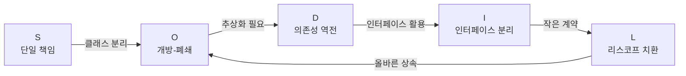

# SOLID — 객체지향 설계 5대 원칙

> [!abstract] 한 줄 요약
> **SOLID**는 유지보수하기 쉽고, 확장 가능하며, 변경에 강한 소프트웨어를 만들기 위한 5가지 설계 원칙이다.

| 약자    | 원칙명                   | 핵심 키워드         |
| ----- | --------------------- | -------------- |
| **S** | Single Responsibility | 하나의 책임         |
| **O** | Open/Closed           | 확장엔 열려, 수정엔 닫혀 |
| **L** | Liskov Substitution   | 하위 타입 대체 가능    |
| **I** | Interface Segregation | 인터페이스 분리       |
| **D** | Dependency Inversion  | 추상에 의존         |

---

## S — 단일 책임 원칙 (Single Responsibility Principle)

> **"클래스는 변경되어야 할 이유가 오직 하나여야 한다."**
> — Robert C. Martin

하나의 클래스(또는 모듈)는 **단 하나의 책임**만 가져야 한다.
책임이 여러 개라면, 하나의 변경이 다른 기능에 의도치 않은 영향을 준다.

### ❌ 위반 예시

```typescript
class UserService {
  getUser(id: string) { /* DB 조회 */ }
  formatUserProfile(user: User) { /* UI 포맷팅 */ }  // ← 책임 분리 필요
  sendWelcomeEmail(user: User) { /* 이메일 발송 */ }  // ← 책임 분리 필요
}
```

### ✅ 준수 예시

```typescript
class UserRepository { getUser(id: string) { /* DB 조회 */ } }
class UserFormatter   { format(user: User) { /* UI 포맷팅 */ } }
class EmailService    { sendWelcome(user: User) { /* 이메일 */ } }
```

> [!tip] 체크 포인트
> "이 클래스가 변경되는 이유가 몇 가지인가?" → 2개 이상이면 분리를 고려하자.

---

## O — 개방-폐쇄 원칙 (Open/Closed Principle)

> **"소프트웨어 개체는 확장에는 열려 있어야 하고, 수정에는 닫혀 있어야 한다."**
> — Bertrand Meyer

새 기능을 추가할 때 **기존 코드를 수정하지 않고** 확장으로 해결해야 한다.
주로 **추상화(인터페이스/추상 클래스)** 와 **다형성**으로 달성한다.

### ❌ 위반 예시

```typescript
// 새 도형 추가 시 calculateArea 수정 필요 → 닫혀있지 않음
function calculateArea(shape: Shape) {
  if (shape.type === 'circle') return Math.PI * shape.radius ** 2;
  if (shape.type === 'square') return shape.side ** 2;
  // 삼각형 추가 → 이 함수를 건드려야 함 ❌
}
```

### ✅ 준수 예시

```typescript
interface Shape {
  area(): number;
}

class Circle implements Shape {
  area() { return Math.PI * this.radius ** 2; }
}
class Square implements Shape {
  area() { return this.side ** 2; }
}
// 삼각형? → Triangle 클래스만 추가하면 끝 ✅
```

> [!tip] 체크 포인트
> "새 요구사항이 생겼을 때 기존 클래스를 열어야 하는가?" → 그렇다면 추상화 부족 신호.

---

## L — 리스코프 치환 원칙 (Liskov Substitution Principle)

> **"프로그램의 객체는 프로그램의 정확성을 깨뜨리지 않으면서 하위 타입의 인스턴스로 바꿀 수 있어야 한다."**
> — Barbara Liskov

**자식 클래스**는 **부모 클래스**를 완전히 대체할 수 있어야 한다.
상속을 잘못 사용하면 "is-a 관계"처럼 보여도 실제로 대체 불가한 경우가 생긴다.

### ❌ 위반 예시 — 정사각형/직사각형 문제

```typescript
class Rectangle {
  setWidth(w: number)  { this.width = w; }
  setHeight(h: number) { this.height = h; }
  area() { return this.width * this.height; }
}

class Square extends Rectangle {
  setWidth(w: number)  { this.width = this.height = w; } // ← 부모 계약 위반!
  setHeight(h: number) { this.width = this.height = h; }
}

// Rectangle로 동작을 기대하는 코드에서 Square를 쓰면 버그 발생
const r: Rectangle = new Square();
r.setWidth(5);
r.setHeight(3);
console.log(r.area()); // 9 (기대: 15) ❌
```

### ✅ 해결 방향

```typescript
interface Shape { area(): number; }
class Rectangle implements Shape { /* ... */ }
class Square    implements Shape { /* ... */ }
// 공통 인터페이스로 묶되 상속 계층은 사용하지 않음
```

> [!warning] 주의
> LSP 위반은 **런타임 버그**로 이어진다. 상속 전에 "진짜 is-a 관계인가?" 를 철저히 검토하자.

---

## I — 인터페이스 분리 원칙 (Interface Segregation Principle)

> **"클라이언트는 자신이 사용하지 않는 메서드에 의존하도록 강요되어서는 안 된다."**
> — Robert C. Martin

하나의 **뚱뚱한 인터페이스** 대신, **작고 구체적인 인터페이스** 여러 개로 분리하라.

### ❌ 위반 예시

```typescript
interface Worker {
  work(): void;
  eat(): void;   // ← 로봇은 밥을 먹지 않음
  sleep(): void; // ← 로봇은 잠을 자지 않음
}

class Robot implements Worker {
  work()  { /* OK */ }
  eat()   { throw new Error("로봇은 먹지 않음"); } // ❌
  sleep() { throw new Error("로봇은 자지 않음"); } // ❌
}
```

### ✅ 준수 예시

```typescript
interface Workable  { work(): void; }
interface Eatable   { eat(): void; }
interface Sleepable { sleep(): void; }

class Human implements Workable, Eatable, Sleepable { /* 모두 구현 */ }
class Robot implements Workable { /* work만 구현 */ }
```

> [!tip] 체크 포인트
> 인터페이스를 구현할 때 `throw new Error("미구현")` 이 나온다면 ISP 위반 신호.

---

## D — 의존성 역전 원칙 (Dependency Inversion Principle)

> **"고수준 모듈은 저수준 모듈에 의존해서는 안 된다. 둘 다 추상화에 의존해야 한다."**
> — Robert C. Martin

구체적인 구현체가 아닌 **추상(인터페이스)** 에 의존하라.
이를 통해 구현체를 교체해도 상위 모듈이 영향받지 않는다.

### ❌ 위반 예시

```typescript
// 고수준 모듈이 저수준 구현체에 직접 의존
class OrderService {
  private db = new MySQLDatabase(); // ← 구체 클래스에 직접 의존 ❌

  saveOrder(order: Order) {
    this.db.save(order);
  }
}
```

### ✅ 준수 예시

```typescript
// 추상화 정의
interface Database {
  save(data: unknown): void;
}

// 고수준 모듈은 추상에만 의존
class OrderService {
  constructor(private db: Database) {} // ← 인터페이스에 의존 ✅

  saveOrder(order: Order) {
    this.db.save(order);
  }
}

// 저수준 모듈들
class MySQLDatabase implements Database { save(data) { /* MySQL */ } }
class MockDatabase   implements Database { save(data) { /* 테스트용 */ } }

// 조립 (DI Container 또는 직접)
const service = new OrderService(new MySQLDatabase());
```

> [!tip] 체크 포인트
> `new ConcreteClass()` 가 비즈니스 로직 안에 있다면 DIP 위반 의심. 생성자 주입(DI)으로 해결.

---

## 원칙 간 관계



> [!note] 핵심 통찰
> SOLID 원칙은 서로 독립적이지 않다. 하나를 잘 지키면 다른 원칙도 자연스럽게 따라온다.
> 결국 모두 **"변경에 강한 코드"** 라는 하나의 목표를 향한다.

---

## 빠른 암기 요약

| 원칙 | 한 문장 기억법 |
|------|--------------|
| **S**RP | 클래스는 **하나**만 책임진다 |
| **O**CP | 추가는 OK, **수정은 NO** |
| **L**SP | 자식은 부모를 **완전히 대체**할 수 있다 |
| **I**SP | 인터페이스는 **작게** 쪼개라 |
| **D**IP | 구현체 말고 **인터페이스**에 의존하라 |
