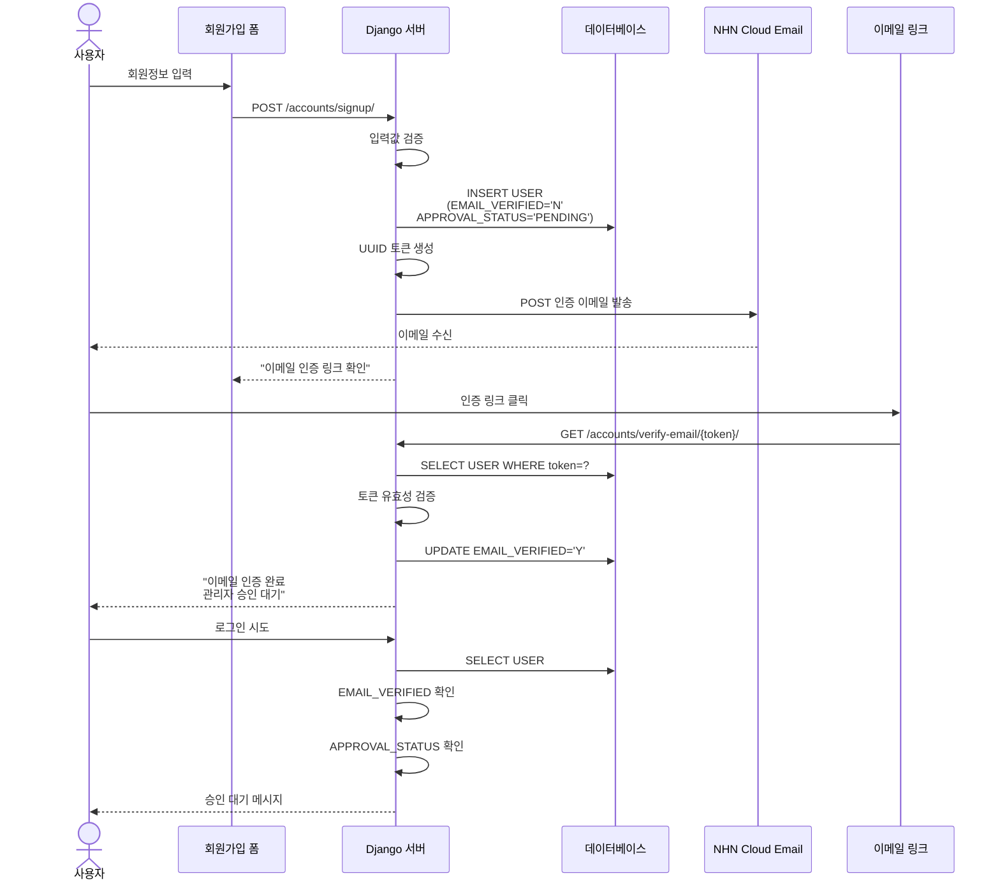

![[static/email-verification.svg]]


```
accounts/
├── email_utils.py          # 이메일 발송
│   ├── generate_verification_code()
│   ├── get_verification_code_template()
│   └── send_verification_code_email()
│
├── views.py                # API 엔드포인트
│   ├── send_email_verification_code()  # POST 코드 발송
│   ├── verify_email_code()             # POST 코드 확인
│   └── signup_view()                   # 세션에서 인증 확인
│
└── urls.py
    ├── /send-verification-code/
    └── /verify-code/

templates/pages/
└── signup.html             # 인증 UI + JavaScript

config/
└── settings.py             # NHN Cloud Email API 설정
```